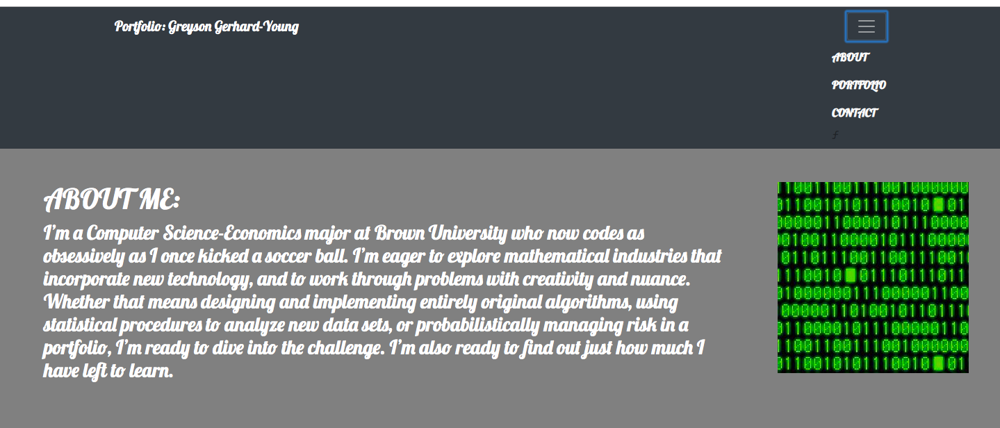

# Bootstrap-Portfolio README

## Project Description: 

A personal portfolio created primarily through the use of Bootstrap components, along with a bit of additional styling. 

[Click here to see the deployed version](https://greysongy.github.io/Bootstrap-Portfolio/)

)

### Technologies Used:

html, css, Javascript, Google Fonts

#### Additional Notes: 

The contact page didn't need the grid system/resizing, since it's components always fit on the page. 

The portfolio page resizes at three break points (small, medium, and large), each time effectively moving one image to a lower row. 

The about page has one break point, which moves the image below the text body. 